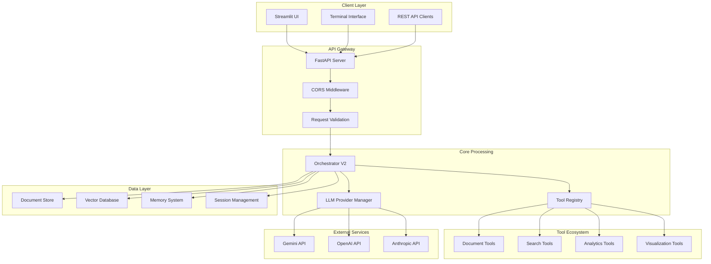

# 📋 Technical Requirements Document (TRD)
## AI Financial Analysis & Risk Management Agent

**Document Version:** 2.0  
**Last Updated:** August 2025  
**System Version:** Production v1.0  

---

## 🎯 Executive Summary

This Technical Requirements Document outlines the architecture, specifications, and implementation requirements for the AI Financial Analysis & Risk Management Agent - a comprehensive document intelligence system designed for financial institutions, regulatory compliance, and risk assessment.

## 🏗️ System Architecture

### 1. High-Level Architecture



### 2. Component Specifications

#### 2.1 FastAPI Server (`main.py`)
- **Framework**: FastAPI 0.100+
- **ASGI Server**: Uvicorn
- **Port**: 8000 (configurable)
- **CORS**: Configurable origins
- **OpenAPI**: Auto-generated documentation

**Key Endpoints:**
```
GET  /health              # System health check
POST /chat                # Chat interface
POST /upload              # Document upload
GET  /documents           # List documents
DELETE /documents/{id}    # Remove document
POST /frontend/chat       # Frontend-optimized chat
```

#### 2.2 Orchestrator V2 System
- **Architecture**: Async, multi-step processing
- **Tool Management**: Dynamic tool registry
- **State Management**: Session-based context
- **Error Handling**: Comprehensive retry logic
- **Performance**: <5s response time target

**Core Components:**
- `orchestrator_v2.py` - Main orchestration engine
- `agent_identity.py` - Agent persona management
- `planning_engine_enhanced.py` - Query planning
- `execution_engine.py` - Tool execution
- `state_management.py` - Session state

#### 2.3 LLM Provider Integration
```python
# Provider Priority
1. Gemini (Primary) - gemini-1.5-pro-latest
2. OpenAI (Fallback) - gpt-4o
3. Anthropic (Fallback) - claude-3.5-sonnet
```

**Configuration:**
- Dynamic provider selection
- Automatic failover on quota/error
- Rate limiting and connection pooling
- Token usage optimization

## 🔧 Technical Specifications

### 3. System Requirements

#### 3.1 Runtime Environment
- **Python Version**: 3.8+ (Recommended: 3.11)
- **Memory**: Minimum 4GB RAM (8GB recommended)
- **Storage**: 10GB available space (for document processing)
- **CPU**: Multi-core processor (async processing optimization)
- **Network**: Stable internet connection for LLM APIs

#### 3.2 Dependencies

**Core Dependencies:**
```requirements
fastapi>=0.100.0
uvicorn[standard]>=0.23.0
python-dotenv>=1.0.0
pydantic>=2.0.0
langchain>=0.1.0
langchain-core>=0.1.0
```

**LLM Providers:**
```requirements
google-generativeai>=0.3.0
langchain-openai>=0.1.0
langchain-anthropic>=0.1.0
```

**Document Processing:**
```requirements
PyPDF2>=3.0.0
python-docx>=0.8.11
pandas>=2.0.0
openpyxl>=3.1.0
```

**Analytics & Visualization:**
```requirements
numpy>=1.24.0
matplotlib>=3.7.0
seaborn>=0.12.0
plotly>=5.15.0
textstat>=0.7.3
textblob>=0.17.1
nltk>=3.8.1
wordcloud>=1.9.2
```

#### 3.3 External Service Requirements

**API Keys Required:**
- Google Gemini API (Primary)
- OpenAI API (Fallback)
- Anthropic API (Fallback)

**Rate Limits:**
- Gemini: 1500 requests/day (free tier)
- OpenAI: Based on billing plan
- Anthropic: Based on billing plan

### 4. Data Architecture

#### 4.1 Document Storage
```json
{
  "storage_format": "JSON + Binary files",
  "document_store": "document_store.json",
  "file_location": "processed_files/",
  "metadata_structure": {
    "file_id": "UUID",
    "original_name": "string",
    "file_type": "PDF|EXCEL|CSV|DOCX",
    "upload_timestamp": "ISO8601",
    "processed_chunks": "array",
    "file_size": "bytes",
    "session_id": "string"
  }
}
```

#### 4.2 Vector Database
- **Implementation**: FAISS (Facebook AI Similarity Search)
- **Embedding Model**: Provider-specific embeddings
- **Index Type**: HNSW (Hierarchical Navigable Small World)
- **Dimension**: 768-1536 (model dependent)

#### 4.3 Memory Management
```
memory/
├── conversations/           # Session-based chat history
│   └── {date}/             # Daily organization
│       └── conv_{id}.json  # Individual conversations
├── rolling_summaries.json  # Conversation summaries
├── search_index.json       # Search optimization
└── short_term.json         # Session cache
```

### 5. Security & Compliance

#### 5.1 Data Security
- **API Keys**: Environment variable storage only
- **File Upload**: Type validation and size limits
- **Session Isolation**: UUID-based session management
- **Error Sanitization**: No sensitive data in logs

#### 5.2 Input Validation
```python
# File Upload Limits
MAX_FILE_SIZE = 50MB
ALLOWED_TYPES = ["pdf", "xlsx", "csv", "docx"]
MAX_FILES_PER_SESSION = 50

# Query Limits
MAX_QUERY_LENGTH = 10000
MAX_SESSION_DURATION = 24_hours
```

#### 5.3 Compliance Features
- Request/Response logging
- Audit trail maintenance
- Data retention policies
- GDPR-compliant data handling

### 6. Performance Requirements

#### 6.1 Response Time Targets
```
Health Check:        < 100ms
Document Upload:     < 10s (per 10MB)
Simple Query:        < 3s
Complex Analysis:    < 30s
Multi-doc Analysis:  < 60s
```

#### 6.2 Throughput Requirements
- **Concurrent Users**: 50+ simultaneous sessions
- **Document Processing**: 100+ documents/hour
- **API Requests**: 1000+ requests/minute
- **Uptime Target**: 99.9%

#### 6.3 Scalability Considerations
- Async processing for I/O operations
- Connection pooling for external APIs
- Configurable rate limiting
- Horizontal scaling capability (future)

### 7. Tool Specifications

#### 7.1 Document Tools (`document_tools.py`)
```python
Functions:
- upload_document()         # Multi-format file processing
- search_documents()        # Semantic document search
- get_document_content()    # Content extraction
- analyze_document()        # Comprehensive analysis
- remove_document()         # Document deletion
```

#### 7.2 Search Tools (`search_tools.py`)
```python
Functions:
- semantic_search()         # Vector-based search
- keyword_search()          # Traditional text search
- multi_document_search()   # Cross-document queries
- search_with_context()     # Context-aware search
```

#### 7.3 Analytics Tools (`text_analytics_tools.py`)
```python
Functions:
- sentiment_analysis()      # Document sentiment
- readability_metrics()     # Text complexity analysis
- keyword_extraction()      # Important term identification
- text_statistics()         # Comprehensive text metrics
```

#### 7.4 Visualization Tools (`visualization_tools.py`)
```python
Functions:
- create_chart()           # Various chart types
- financial_dashboard()    # Finance-specific visuals
- comparison_plots()       # Multi-dataset comparisons
- export_visualization()   # Chart export functionality
```

### 8. Configuration Management

#### 8.1 Environment Configuration
```python
# config.py structure
class Config:
    api: APIConfig
    ai: AIConfig
    logging: LoggingConfig
    storage: StorageConfig
    security: SecurityConfig
```

#### 8.2 Runtime Configuration
```env
# Core Settings
PORT=8000
HOST=0.0.0.0
DEBUG=false
LOG_LEVEL=INFO

# LLM Configuration
LLM_PROVIDER=gemini
GEMINI_API_KEY=your_key
OPENAI_API_KEY=your_key
ANTHROPIC_API_KEY=your_key

# Performance Tuning
MAX_CONCURRENT_REQUESTS=50
CHUNK_SIZE=40000
CHUNK_OVERLAP=2000
```

### 9. Deployment Requirements

#### 9.1 Local Development
```bash
# Setup commands
python -m venv venv
source venv/bin/activate
pip install -r requirements.txt
cp .env.template .env
python main.py
```

#### 9.2 Production Deployment
```bash
# Docker deployment (future)
docker build -t ai-finance-agent .
docker run -p 8000:8000 --env-file .env ai-finance-agent

# Process management
nohup python main.py > server.log 2>&1 &
```

#### 9.3 Monitoring & Health Checks
- `/health` endpoint monitoring
- Log aggregation and analysis
- Performance metrics collection
- Error rate monitoring

### 10. Testing Requirements

#### 10.1 Unit Testing
- Individual tool functionality
- Configuration validation
- Error handling scenarios
- Performance benchmarks

#### 10.2 Integration Testing
- End-to-end API workflows
- Multi-document processing
- LLM provider failover
- Session management

#### 10.3 Load Testing
- Concurrent user simulation
- Document processing limits
- API rate limit testing
- Memory usage optimization

### 11. Maintenance & Support

#### 11.1 Logging & Monitoring
```python
# Log Levels
DEBUG: Detailed operation info
INFO:  General system events
WARN:  Potential issues
ERROR: System errors requiring attention
```

#### 11.2 Backup & Recovery
- Document store backup procedures
- Configuration backup
- Memory/conversation backup
- Disaster recovery planning

#### 11.3 Updates & Versioning
- Semantic versioning (MAJOR.MINOR.PATCH)
- Rolling updates capability
- Backward compatibility maintenance
- Migration procedures

---

## 📞 Technical Contacts

**System Architecture**: AI Development Team  
**API Integration**: Backend Development Team  
**Security & Compliance**: Security Team  
**Performance Optimization**: DevOps Team  

---

**Document Classification**: Technical Specification  
**Review Cycle**: Quarterly  
**Next Review**: November 2025